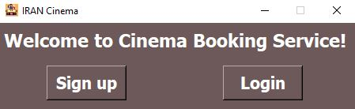
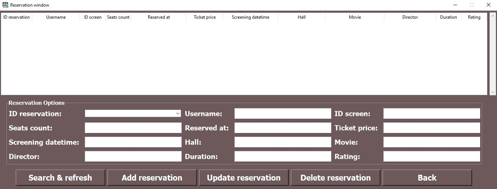
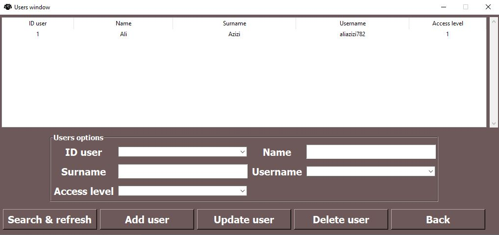
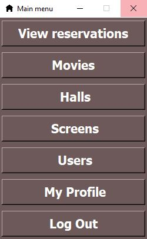

🎬 Cinema Booking System

A complete desktop application for managing cinema reservations, built with Python and Tkinter.

This system allows administrators to manage movies, halls, screenings, and users, while regular users can browse available screenings and book tickets.

✨ Features

User Authentication – Sign up and login with two access levels: Admin (level 1) and Regular User (level 2).

Movie Management – Add, edit, delete, and search for movies (title, director, genre, duration, release date, rating).

Hall Management – Create and delete cinema halls with specified capacity.

Screening Management – Schedule screenings by linking a movie, a hall, a datetime, and a ticket price. Conflict detection prevents double-booking.

Ticket Reservation – Users can select a screening, choose the number of seats, and complete a reservation. The system validates remaining capacity in real time.

Reservation History – Users can view their own reservations; admins can see all reservations and perform CRUD operations.

User Management – Admins can add, update, or delete users, including changing access levels.

Profile Editing – Users can update their personal information and password; admins can also change access levels.

🛠️ Technologies

Python 3.6+

Tkinter – GUI framework (with ttk for modern Treeview widgets)

MySQL – Relational database

pymysql – MySQL driver for Python

DBUtils – Connection pooling for better performance and reliability

Pillow (PIL) – For handling window icons

📋 Prerequisites

Python 3.6 or higher

MySQL Server (5.7 or 8.0 recommended)

pip (Python package manager)

🎯 Two Versions Available

This project includes **two versions** of the cinema booking:

| **Tkinter Version** | classic version |

| **CustomTkinter Version** | modern version |

**NOTE:Customtkinter file is only for showing modern UI and may have some small bugs.**  

🚀 Installation & Setup

1. Clone the repository

git clone https://github.com/aliazizi782-ai/cinema-booking.git

cd cinema-booking

2. Install dependencies

pip install -r requirements.txt

If you don't have a requirements.txt file, the required packages are:

pymysql>=1.0.0

DBUtils>=3.0.0

Pillow>=9.0.0

cryptography>=39.0.0

use 'pip install -r requirements.txt' to intall all them.

3. Database configuration

Start your MySQL server.

By default, the application tries to connect to localhost with user root and password root.

You can change these credentials inside db_connection.py in the Connection class constructor:

python

def __init__(self, host="127.0.0.1", user="root", password="root"):

The database cinema_booking and all tables will be created automatically on the first run.

4. Run the application

python cinema_app.py

🧑‍💻 User Roles

Role	Access Level	Permissions

Admin	1	Full control: manage movies, halls, screenings, users, and view all reservations

Regular User	2	View upcoming screenings, book tickets, view own reservations, edit own profile

The first user registered will be assigned level 2 (regular user). To create an admin, you must manually insert a user with access_level=1 into the database or use the admin panel after login.

🗂️ Database Schema

The system uses five main tables:

users – id, name, surname, username, password (hashed), access_level

movies – id, title, director, genre, duration, release_date, rating

halls – id, name, capacity

screening – id, movie (FK), hall (FK), screening_datetime, ticket_price

reservations – id, user (FK), screening (FK), seats_count, reserved_at

All foreign keys are protected with ON DELETE RESTRICT to maintain data integrity.

💡 Usage Tips

Default admin login – There is no default admin; you must create one either via SQL or through the "Add user" function in the admin panel after logging in as an admin.

Date/time format – All datetime fields must follow the pattern YYYY-MM-DD HH:MM:SS (e.g., 2026-07-03 18:30:00).

Search filters – Most windows support search by any field; leaving fields empty returns all records.

Reservation restriction – Regular users can only book screenings that have not yet started.

📄 License

This project is open‑source and available under the MIT License.

🤝 Contributing

Contributions are welcome! If you find a bug or have a feature request, please open an issue or submit a pull request.

Fork the repository.

Create a new branch (git checkout -b feature/AmazingFeature).

Commit your changes (git commit -m 'Add some AmazingFeature').

Push to the branch (git push origin feature/AmazingFeature).

Open a Pull Request.

📞 Contact

Author:Ali Azizi

For any questions or support, please reach out via:

Email:aliazizi@gmail.com

https://github.com/aliazizi782-ai

https://pypi.org/user/aliazizi782

Status:Computer Engineering Student

Level:Beginner (actively learning!)

💌 Feel free to email me! I'm happy to discuss problems, suggestions, or just talk about Python.

🙏 Acknowledgements

Built with ❤️ using Python, Tkinter, and MySQL.

Inspired by Dr. django's Python courses 

Special thanks to the Python community and the open‑source community for the excellent libraries.

Thanks to everyone who supports beginner developers!

If you like this project, please give it a star! ⭐

Happy coding! 🎥🎟️

📸 Screenshots

📬 Contact

Author:Ali Azizi

Email:aliazizi@gmail.com

https://github.com/aliazizi782-ai

https://pypi.org/user/aliazizi782

Status:Computer Engineering Student

Level:Beginner (actively learning!)

💌 Feel free to email me! I'm happy to discuss problems, suggestions, or just talk about Python.

📄 License

This project is open-source and available under the MIT License.

